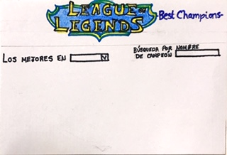
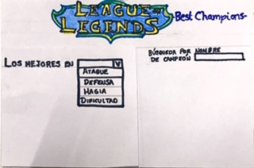

# League of Leguends 
## The best champions

- ¿Quiénes son los principales usuarios de producto?

Para conocer cuáles son los principales usuarios de nuestra producto, fue necesario implementar una [encuesta](https://docs.google.com/forms/d/e/1FAIpQLSfW9ab_oeWpF0oaqgT0WdOyAREq6X6dNxgZbf2nA7xGUZPpPg/viewform), la cual nos mostró que el 87% de los usuarios entrevistados que juegan LoL son hombres. Su edad oscila entre los 18 y 33 años; y el lapso de tiempo que llevan jugando es de 2 a 6 años.

- ¿Cuáles son los objetivos de estos usuarios en relación con el producto?

Los objetivos de los usuarios es consultar en una app los atributos que ellos consideran más relevantes de los campeones de manera práctica al momento de diseñar su estrategia de juego. 

- ¿Cuáles son los datos más relevantes que quieren ver en la interfaz y por qué?

Los usuarios reportan que la información que desean visualizar en la interfaz son los mejores atributos de los 10 mejores campeones en forma de tarjetas.

- ¿Cuándo utilizan o utilizarían el producto?

Crear una estrategia de juego en Lol es una tarea compleja, para diseñarla es necesario conocer los atributos de los mejores campeones, con el fin de tener mayores posibilidades de ganar la partida, por tal razón, los usuarios utilizarían nuestra aplicación al momento en el que deseen conocer rápidamente los atributos de los campeones para crear una mejor estrategia de juego.

### Definición del producto

El producto está diseñado a partir de las necesidades de nuestros usuarios, quienes solicitaron que los datos se mostrarán en una sola pantalla, con el fin de que la búsqueda fuera ágil y eficaz, ya que consideran que las páginas que hoy existen son muy engorrosas.

Aunque la página de League of Leguends muestra toda la información sobre los campeones, los usuarios reportaron la necesidad de vizualizar los atributos de los campeones de una forma más concreta y accesible, ya que la página tiene como objetivo documentar al jugador y no proporcionarle información ágil para crear de manera inmediata su estrategia de juego.

### Historias de usuario

1. Al ingresar a la página deseo:

    - Ver los mejores 10 atributos de los campeones de League of Leguends.
    - Ver a los 10 mejores campeones con base en el atributo filtrado.

<!-- ### Diseño de la Interfaz de Usuario -->

#### Prototipo de baja fidelidad

En este momento del proyecto nos encontramos testeando nuestro primer prototipo [(ver aqui)](https://marvelapp.com/415d1h8) de baja fidelidad en la aplicación Marvel, con el fin de conocer si cumple con las necesidades del usuario.

A continuación se muestran las pantallas para el prototipo de baja fidelidad:
La primera pantalla es mostrar el logo de LoL con el nombre específico de nuestro producto.


La segunda pantalla tiene como objetivo mostrar la opción de filtrar por atributo o por nombre de campeón.



En la tercera vista se muestra el menu desplegable del filtrado para que el usuario seleccione el que sea de su interés.



Por útilmo se muestran 2 opciones para presentar la información del filtrado, ya sea en tarjetas, como se muestra a continuación.


O en forma de tabla:


En caso de que el usuario desee visualizar alguna búsqueda por nombre, se propone la siguiente presentación:


<!-- #### Prototipo de alta fidelidad

Lo siguiente es diseñar tu Interfaz de Usuario (UI por sus siglas en inglés -
_User Interface_). Para eso debes aprender a utilizar alguna herramienta de
diseño visual. Nosotros te recomendamos [Figma](https://www.figma.com/) que es
una herramienta que funciona en el navegador y, además, puedes crear una cuenta
gratis. Sin embargo, eres libre de utilizar otros editores gráficos como
Illustrator, Photoshop, PowerPoint, Keynote, etc.

#### Testeos de usabilidad

Durante el reto deberás realizar tests de usabilidad con distintos usuarios, y
en base a los resultados de esos tests, deberás iterar tus diseños. Cuéntanos
qué problemas de usabilidad detectaste a través de los tests y cómo los
mejoraste en tu propuesta final.

### Implementación de la Interfaz de Usuario (HTML/CSS/JS)

Luego de diseñar tu interfaz de usuario deberás trabajar en su implementación.
Como mencionamos, **no** es necesario que construyas la interfaz tal como la
diseñaste. Tendrás un tiempo limitado para hackear, así es que deberás
priorizar.

Como mínimo, tu implementación debe:

1. Mostrar la data en una interfaz: puede ser un card, una tabla, una lista, etc.
2. Permitir al usuario filtrar y ordenar la data.
3. Calcular estadísticas de la colección (o subcolección) como media aritmética,
   máximo y/o mínimo de algún atributo numérico, o contar cuántas veces aparece
   un determinado valor, por ejemplo.
4. Visualizarse sin problemas desde distintos tamaños de pantallas: móviles,
   tablets y desktops.

Es importante que tu interfaz, a pesar de ser una versión mínima de tu ideal,
siga los fundamentos de _visual design_.

### Pruebas unitarias

El _boilerplate_ de este proyecto no incluye pruebas unitarias, pero esperamos
que escribas tus propias pruebas unitarias para las funciones encargadas de
_procesar_, _filtrar_ y _ordenar_ la data, así como _calcular_ estadísticas.
Para ello te recomendamos implementar las siguientes funciones en el archivo
`src/data.js`:

- `filterData(data, condition)`: esta función `filter` o filtrar recibiría la
  data, y nos retornaría aquellos datos que sí cumplan con la condición.

- `sortData(data, sortBy, sortOrder)`: esta función `sort` u ordenar
  recibe tres parámetros.
  El primer parámetro, `data`, nos entrega los datos.
  El segundo parámetro, `sortBy`, nos dice con respecto a cuál de los campos de
  la data se quiere ordenar.
  El tercer parámetro, `sortOrder`, indica si se quiere ordenar de manera
  ascendente o descendente.

- `computeStats(data)`: la función `compute` o calcular, nos permitirá hacer
  cálculos estadísticos básicos para ser mostrados de acuerdo a la data
  proporcionada.

Estas son propuestas de funciones que podrías implementar.

El archivo `src/data.js` debe tener una cobertura del 70% de _statements_
(_sentencias_), _functions_ (_funciones_), _lines_ (_líneas_), y _branches_
(_ramas_).

**Estas funciones deben ser [_puras_](https://medium.com/laboratoria-developers/introducci%C3%B3n-a-la-programaci%C3%B3n-funcional-en-javascript-parte-2-funciones-puras-b99e08c2895d)
e independientes del DOM**. Estas funciones serán después usadas desde el archivo
`src/main.js`, al cargar la página, y cada vez que el usuario interactúe (click,
filtrado, ordenado, ...).

## Hacker edition -->

<!-- Features/características extra sugeridas:

- En lugar de consumir la data estática brindada en este repositorio, puedes
  consumir la data de forma dinámica, cargando un archivo JSON por medio de
  `fetch`. La carpeta `src/data` contiene una versión `.js` y una `.json`
  de cada set datos.
- Agregarle a tu interfaz de usuario implementada visualizaciones gráficas. Para
  ello te recomendamos explorar librerías de gráficas como [Chart.js](https://www.chartjs.org/)
  o [Google Charts](https://developers.google.com/chart/).

## Consideraciones técnicas -->

<!-- La lógica del proyecto debe estar implementada completamente en JavaScript
(ES6), HTML y CSS. En este proyecto NO está permitido usar librerías o
frameworks, solo [vanilla JavaScript](https://medium.com/laboratoria-how-to/vanillajs-vs-jquery-31e623bbd46e),
con la excepción de librerías para hacer gráficas (charts); ver
[_Hacker Edition_](#parte-opcional-hacker-edition) más arriba.

No se debe utilizar la _pseudo-variable_ `this`.

El _boilerplate_ contiene una estructura de archivos como punto de partida así
como toda la configuración de dependencias: -->

<!-- ```text
.
├── package.json
├── README.md
├── src
│   ├── data
│   │   ├── injuries
│   │   │   ├── injuries.js
│   │   │   └── injuries.json
│   │   ├── lol
│   │   │   ├── lol.js
│   │   │   └── lol.json
│   │   ├── pokemon
│   │   │   ├── pokemon.js
│   │   │   └── pokemon.json
│   │   ├── steam
│   │   │   ├── steam.js
│   │   │   └── steam.json
│   │   └── worldbank
│   │       ├── worldbank.js
│   │       └── worldbank.json
│   ├── data.js
│   ├── index.html
│   ├── main.js
│   └── style.css
└── test
    └── data.spec.js

8 directories, 17 files
``` -->

<!-- ### `src/index.html`

Al igual que en el proyecto anterior, existe un archivo `index.html`. Como ya
sabrás, acá va la página que se mostrará al usuario. También nos sirve para
indicar qué scripts se usarán y unir todo lo que hemos hecho.

En este archivo encontrarás una serie de _etiquetas_ (_tags_) `<script>`
_comentadas_. Para _cargar_ las diferentes fuentes de datos tendrás que
_descomentar_ estas _etiquetas_. Cada uno de estos scripts asignará una variable
global con la data correspondiente a esa fuente de datos.

Por ejemplo, si descomentamos la siguiente línea:

```html
<!-- <script src="./data/worldbank/worldbank.js"></script> -->
<!-- ``` --> 

<!-- La línea quedaría así:

```html
<script src="./data/worldbank/worldbank.js"></script>
``` -->

<!-- Y ahora tendríamos la variable global `WORLDBANK` disponible en nuestros otros
scripts (como `src/data.js` o `src/main.js`). -->

<!-- ### `src/main.js`

Recomendamos usar `src/main.js` para todo tu código que tenga que ver con
mostrar los datos en la pantalla. Con esto nos referimos básicamente a la
interacción con el DOM. Operaciones como creación de nodos, registro de
manejadores de eventos (_event listeners_ o _event handlers_), ....

Esta no es la única forma de dividir tu código, puedes usar más archivos y
carpetas, siempre y cuando la estructura sea clara para tus compañeras. -->

<!-- ### `src/data.js`

El corazón de este proyecto es la manipulación de datos a través de arreglos y
objetos. La idea de este archivo es contener toda la funcionalidad
que corresponda a obtener, procesar y manipular datos.

En este archivo esperamos que implementes las funciones detalladas en la sección
de [_Pruebas Unitarias_](#pruebas-unitarias). -->

<!-- ### `src/data`

En esta carpeta están los datos de las diferentes fuentes. Encontrarás una
carpeta por cada fuente, y dentro de cada carpeta dos archivos: uno con la
extensión `.js` y otro `.json`. Ambos archivos contienen la misma data; la
diferencia es que el `.js` lo usaremos a través de una etiqueta `<script>`,
mientras que el `.json` está ahí para opcionalmente cargar la data de forma
asíncrona con [`fetch()`](https://developer.mozilla.org/es/docs/Web/API/Fetch_API)
(ver sección de [_Parte Opcional_](#parte-opcional-hacker-edition)). -->

<!-- ### `test/data.spec.js`

Tendrás también que completar las pruebas unitarias de las funciones
implementadas en el archivo `data.js`.

--- -->

<!-- ## Pistas sobre cómo empezar a trabajar en el proyecto

Antes de empezar a escribir código, debes definir qué deberá hacer el producto
en base al conocimiento que puedas obtener de tu usuario. Estas preguntas te
pueden ayudar: -->

<!-- Cuando ya estés lista para codear, te sugerimos empezar de esta manera: -->

<!-- 1. Una de las integrantes del equipo debe realizar un :fork_and_knife:
   [fork](https://help.github.com/articles/fork-a-repo/) del repo de tu cohort,
   tus \_coaches\* te compartirán un \_link\* a un repo y te darán acceso de lectura
   en ese repo. La otra integrante del equipo deber hacer un fork **del
   repositorio de su compañera** y [configurar](https://gist.github.com/BCasal/026e4c7f5c71418485c1)
   un `remote` hacia el mismo.
2. :arrow_down: [Clona](https://help.github.com/articles/cloning-a-repository/)
   tu :fork_and_knife: [fork](https://help.github.com/articles/fork-a-repo/) a tu computadora (copia local).
3. 📦 Instala las dependencias del proyecto con el comando `npm install`. Esto
   asume que has instalado [Node.js](https://nodejs.org/) (que incluye [npm](https://docs.npmjs.com/)).
4. Si todo ha ido bien, deberías poder ejecutar las :traffic_light:
   pruebas unitarias (unit tests) con el comando `npm test`.
5. A codear se ha dicho! :rocket: -->

---

<!-- ## Contenido de referencia

### Diseño de experiencia de usuario (User Experience Design)

- Investigación con usuarios / entrevistas
- Principios de diseño visual -->

<!-- ### Desarrollo Front-end

- Unidad de testing en curso de JavaScript en LMS.
- Unidad de arreglos en curso de JavaScript en LMS.
- Unidad de objetos en curso de JavaScript en LMS.
- Unidad de funciones en curso de JavaScript en LMS.
- Unidad de DOM en curso de Browser JavaScript en LMS.
- [Array en MDN](https://developer.mozilla.org/es/docs/Web/JavaScript/Referencia/Objetos_globales/Array)
- [Array.sort en MDN](https://developer.mozilla.org/es/docs/Web/JavaScript/Referencia/Objetos_globales/Array/sort)
- [Array.map en MDN](https://developer.mozilla.org/es/docs/Web/JavaScript/Referencia/Objetos_globales/Array/map)
- [Array.filter en MDN](https://developer.mozilla.org/es/docs/Web/JavaScript/Referencia/Objetos_globales/Array/filter)
- [Array.reduce en MDN](https://developer.mozilla.org/es/docs/Web/JavaScript/Referencia/Objetos_globales/Array/reduce)
- [Array.forEach en MDN](https://developer.mozilla.org/es/docs/Web/JavaScript/Referencia/Objetos_globales/Array/forEach)
- [Object.keys en MDN](https://developer.mozilla.org/es/docs/Web/JavaScript/Referencia/Objetos_globales/Object/keys)
- [Object.entries en MDN](https://developer.mozilla.org/es/docs/Web/JavaScript/Referencia/Objetos_globales/Object/entries)
- [Fetch API en MDN](https://developer.mozilla.org/en-US/docs/Web/API/Fetch_API)
- [json.org](https://json.org/json-es.html)

### Herramientas

- [Git](https://git-scm.com/)
- [GitHub](https://github.com/)
- [GitHub Pages](https://pages.github.com/)
- [Node.js](https://nodejs.org/)
- [Jest](https://jestjs.io/)

---

## Checklist

- [ ] Usa VanillaJS.
- [ ] No hace uso de `this`.
- [ ] Pasa linter (`npm pretest`)
- [ ] Pasa tests (`npm test`)
- [ ] Pruebas unitarias cubren un mínimo del 70% de statements, functions y
      lines y branches.
- [ ] Incluye _Definición del producto_ clara e informativa en `README.md`.
- [ ] Incluye historias de usuario en `README.md`.
- [ ] Incluye _sketch_ de la solución (prototipo de baja fidelidad) en
      `README.md`.
- [ ] Incluye _Diseño de la Interfaz de Usuario_ (prototipo de alta fidelidad)
      en `README.md`.
- [ ] Incluye el listado de problemas que detectaste a través de tests de
      usabilidad en el `README.md`.
- [ ] UI: Muestra lista y/o tabla con datos y/o indicadores.
- [ ] UI: Permite ordenar data por uno o más campos (asc y desc).
- [ ] UI: Permite filtrar data en base a una condición. -->

<!-- ## Checklist (Hacker Edition) -->
<!-- 
- [ ] Consume data de forma dinámica (`fetch()`).
- [ ] Utiliza Librerías de graficas (`chart.js` ó `google chart`).
- [ ] Cobertura de coverage al 100%. -->
